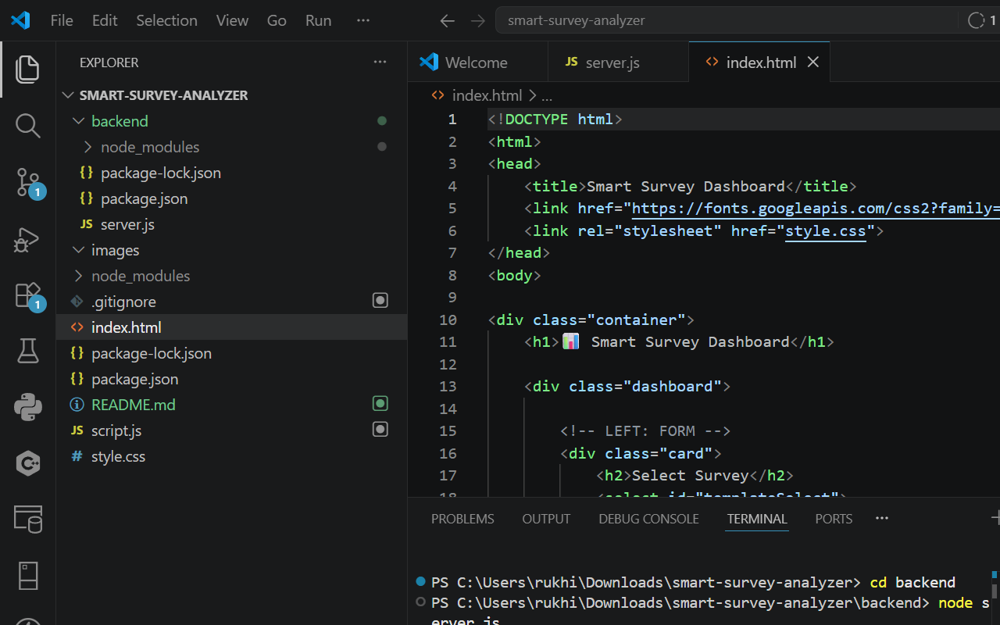
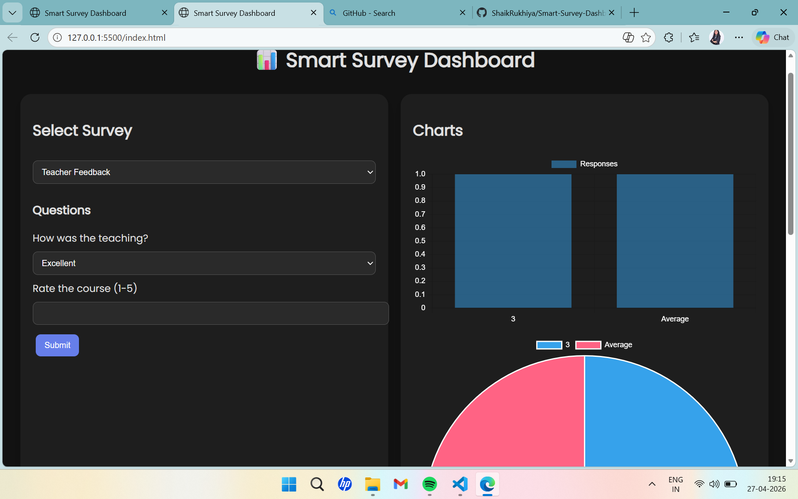

# Smart Survey Dashboard

A modern, responsive survey analysis dashboard built with HTML, CSS, JavaScript, Node.js, Express, and MongoDB.

## Features

- 📊 Real-time survey data visualization with charts
- 🎨 Dark/Light mode toggle
- 📱 Responsive design
- 🔄 Live data updates from MongoDB
- 📈 Analytics dashboard with ratings and statistics
- 📋 Multiple survey templates (Teacher Feedback, Event Feedback)
- 💾 Data persistence and CSV export

## Screenshots

### Dashboard Overview

*The main dashboard showing survey form, charts, analytics, and response history*

### Survey Form

*Interactive survey form with dynamic question loading*

### Charts and Analytics

*Bar chart, pie chart, and analytics metrics*

### Dark Mode

*Dashboard in dark mode for better visibility*

## Installation

### Prerequisites
- Node.js (v14 or higher)
- MongoDB (running locally on port 27017)
- Git

### Setup

1. **Clone the repository:**
   ```bash
   git clone https://github.com/ShaikRukhiya/Smart-Survey-Dashboard.git
   cd smart-survey-analyzer
   ```

2. **Install backend dependencies:**
   ```bash
   cd backend
   npm install
   ```

3. **Start MongoDB:**
   Make sure MongoDB is running on `mongodb://127.0.0.1:27017`

4. **Start the backend server:**
   ```bash
   node server.js
   ```
   Server will run on http://localhost:5000

5. **Open the frontend:**
   Open `index.html` in your web browser

## Usage

1. Select a survey type from the dropdown
2. Fill out the survey form
3. Submit to see real-time updates in charts and analytics
4. View response history in the table
5. Export data to CSV
6. Toggle dark mode for better viewing

## API Endpoints

- `POST /submit` - Submit survey response
- `GET /responses` - Get all responses
- `DELETE /reset` - Clear all data

## Technologies Used

- **Frontend:** HTML5, CSS3, JavaScript (ES6+), Chart.js
- **Backend:** Node.js, Express.js, MongoDB, Mongoose
- **Styling:** Custom CSS with responsive design

## Project Structure

```
smart-survey-analyzer/
├── index.html          # Main HTML file
├── script.js           # Frontend JavaScript
├── style.css           # Stylesheet
├── README.md           # Project documentation
└── backend/
    ├── server.js       # Express server
    └── package.json    # Backend dependencies
```

## Contributing

1. Fork the repository
2. Create a feature branch
3. Make your changes
4. Test thoroughly
5. Submit a pull request

## License

MIT License - feel free to use and modify!

## Author

Shaik Rukhiya